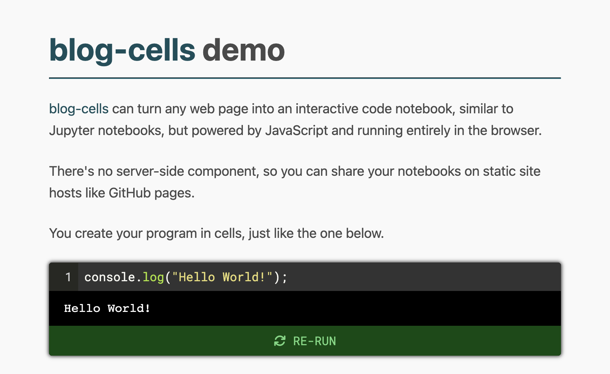

# blog-cells
[](https://github.com/rameshvarun/blog-cells/actions/workflows/node.js.yml)

<a href="https://rameshvarun.github.io/blog-cells/">
<p align="center"></img></p>
<p align="center">[VIEW DEMO]</p>
</a>

Add interactive code cells to any webpage, similar to [Jupyter](https://jupyter.org/) or [ObservableHQ](https://observablehq.com/). Works with static site generators like Jekyll and Hugo.

Just drop JS / CSS import tags onto your page start creating code cells using `<script type="text/notebook-cell">` elements. blog-cells will transform these script tags into interactive, runnable code snippets.

```html
<script type="text/notebook-cell">
console.log("Hello World!");
</script>

<!-- Import blog-cells after your cells are defined. -->
<link rel="stylesheet" href="https://cdn.jsdelivr.net/gh/rameshvarun/blog-cells@0.3.0/dist/blog-cells.css" />
<script type="module" src="https://cdn.jsdelivr.net/gh/rameshvarun/blog-cells@0.3.0/dist/blog-cells.js"></script>
```

<a href="https://glitch.com/edit/#!/remix/blog-cells-example"></a>

## Alternatives
- https://starboard.gg/
- https://observablehq.com/
- https://jupyter.org/try-jupyter/lab/
- https://www.typecell.org/
